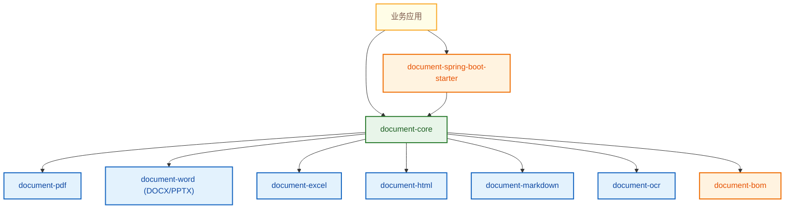

# 文档解析引擎（Document Parsing Engine）

一个模块化的 Java 文档解析库，提供统一输出模型，支持 SPI 扩展、异步/批量解析、流式事件输出，以及可选 OCR 能力。

## 项目亮点

- 统一模型：不同格式输出到同一套 `Document / Page / Block / Table / Image` 结构
- 多格式支持：`PDF / DOCX / PPTX / XLSX / HTML / Markdown / TXT / IMAGE`
- 多种调用方式：单文件、批量、异步、流式事件
- 可扩展：基于 Java `ServiceLoader` 的解析器 SPI 和处理器 Pipeline
- 开箱即用：提供 `document-spring-boot-starter` 自动装配

## 模块说明

- `document-core`：引擎、模型、格式识别、解析器 SPI、后处理 Pipeline
- `document-pdf`：PDF 解析（PDFBox）
- `document-word`：DOCX / PPTX 解析（Apache POI）
- `document-excel`：XLSX 解析（Apache POI 事件模型）
- `document-html`：HTML 解析（Jsoup）
- `document-markdown`：Markdown 解析（commonmark-java）
- `document-ocr`：图片解析 + Tesseract OCR
- `document-spring-boot-starter`：Spring Boot 自动配置
- `document-bom`：依赖版本对齐

## 架构图（Mermaid）



## 解析流程图（Mermaid）


## Spring Boot 自动装配流程（Mermaid）


## 快速开始

### 单文件解析

```java
DocumentEngine engine = DocumentEngine.builder()
    .autoRegister()
    .build();

Document document = engine.parse(new File("test.pdf"));
System.out.println(document.getRawText());
```

### 批量解析

```java
List<Document> documents = engine.parseBatch(List.of(
    new File("a.docx"),
    new File("b.pptx"),
    new File("c.xlsx")
));
```

### 异步批量解析

```java
CompletableFuture<List<Document>> future = engine.parseBatchAsync(List.of(
    new File("a.pdf"),
    new File("b.md")
));

List<Document> documents = future.join();
```

### 流式解析（适合大文件）

```java
try (Stream<BlockEvent> events = engine.parseStream(inputStream, "large.pdf")) {
    events.forEach(event -> {
        // PAGE_START / BLOCK / PAGE_END / DONE
    });
}
```

## Spring Boot 使用

引入 `document-spring-boot-starter` 后，`DocumentEngine` 会自动注入。

配置示例：

```yaml
document:
  engine:
    async:
      core-pool-size: 4
      max-pool-size: 16
      queue-capacity: 200
    ocr:
      enabled: true
      fail-on-error: false
      data-path: /opt/tessdata
    parser:
      max-pages: -1
      charset: UTF-8
      low-text-density-threshold: 40
    pipeline:
      watermark-cleanup-enabled: false
```

业务代码示例：

```java
@Service
public class DocumentService {
    private final DocumentEngine engine;

    public DocumentService(DocumentEngine engine) {
        this.engine = engine;
    }

    public Document parseOne(File file) {
        return engine.parse(file);
    }

    public List<Document> parseMany(List<File> files) {
        return engine.parseBatch(files);
    }
}
```

## SPI 扩展（自定义解析器）

1. 实现 `com.document.parsing.core.parser.DocumentParser`
2. 在 `META-INF/services/com.document.parsing.core.parser.DocumentParser` 中注册实现类
3. 通过 `DocumentEngine.builder().autoRegister()` 自动装载

## 构建与测试

```bash
mvn clean test
```

仅跑某个模块：

```bash
mvn -pl document-word -am test
```

## OCR 集成测试（可选）

在准备好本地 Tesseract 数据后执行：

```bash
export RUN_OCR_IT=true
export TESSDATA_PREFIX=/path/to/tessdata-parent
mvn -pl document-ocr test
```

## 相关文档

- Pipeline 扩展：`docs/pipeline.md`
- SPI 扩展：`docs/spi-extension.md`
- Spring Boot Starter：`docs/spring-boot-starter.md`
